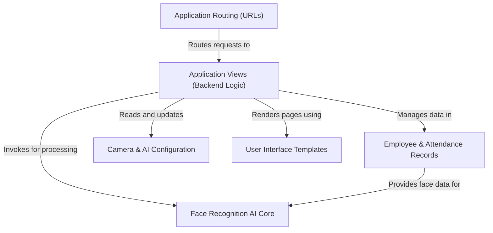
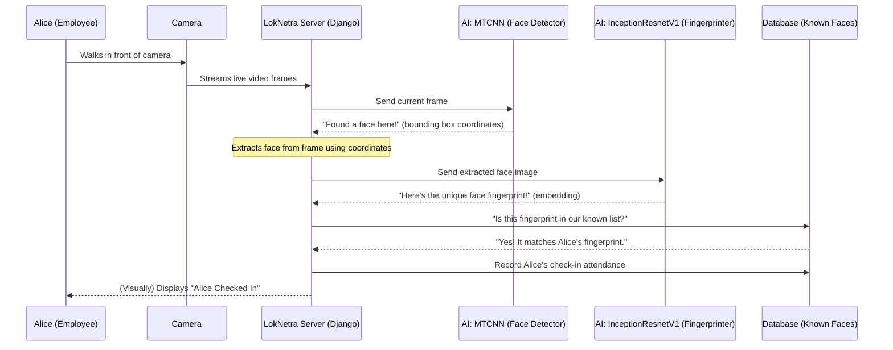
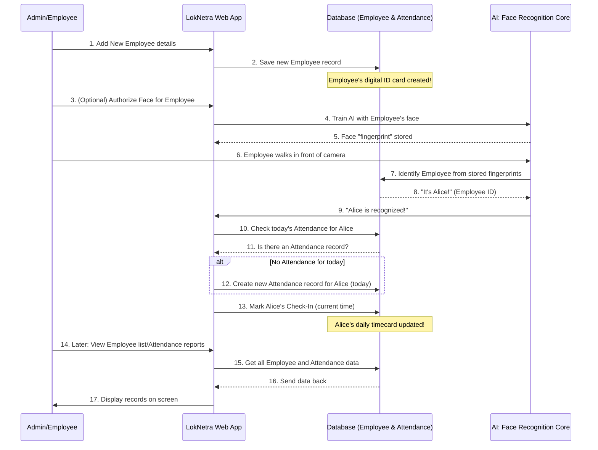
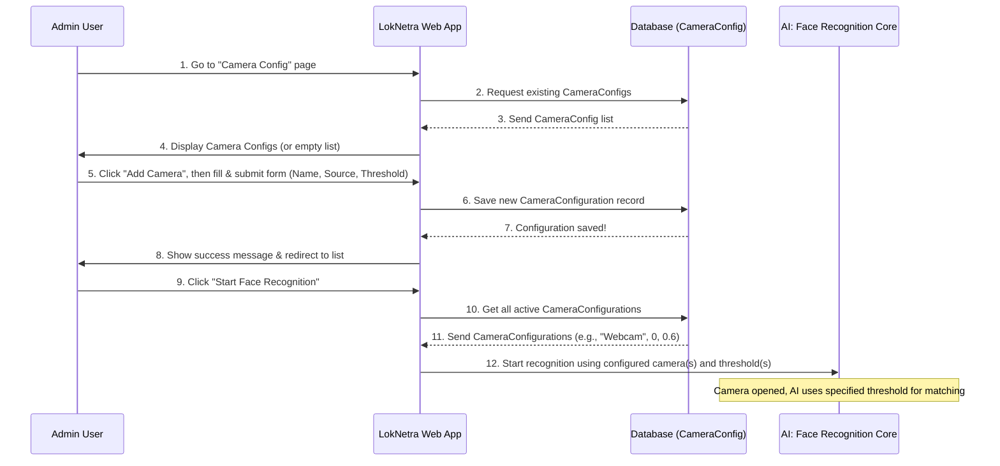
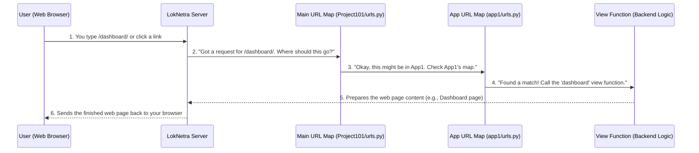
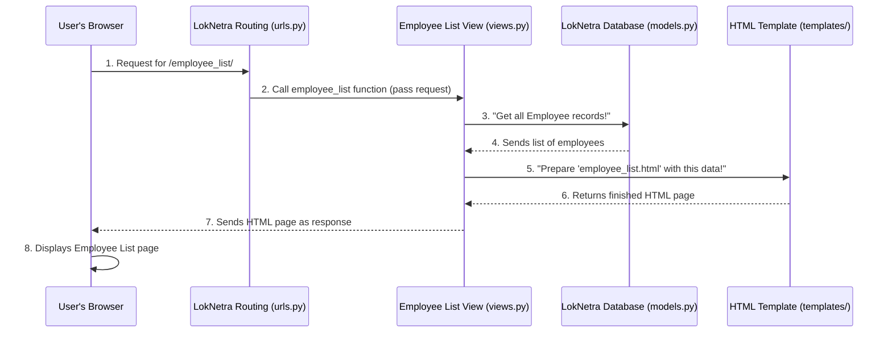
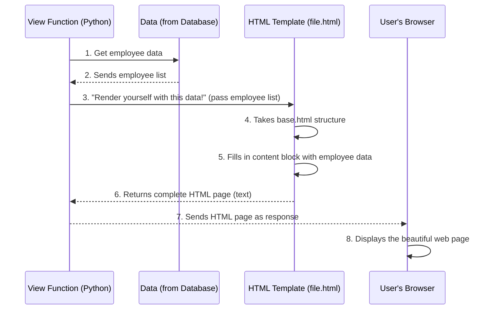

# LokNetra

LokNetra is a **Workforce Attendance & Safety Monitoring System** that uses **AI-powered face recognition** to automatically track employee presence. It allows administrators to *register employees*, *configure cameras*, monitor *attendance records*, and view a *dashboard* with key operational insights and potential safety alerts. The system automates the traditionally manual process of marking attendance, enhancing efficiency and accuracy.


## Visual Overview



## Chapters

1. [Face Recognition AI Core](#Chapter-1-Face-Recognition-AI-Core)
2. [Employee & Attendance Records](#Chapter-2-Employee--Attendance-Records)
3. [Camera & AI Configuration](#Chapter-3-Camera--AI-Configuration)
4. [Application Routing (URLs)](#Chapter-4-Application-Routing-URLs)
5. [Application Views (Backend Logic)](#Chapter-5-Application-Views-(Backend-Logic))
6. [User Interface Templates](#Chapter-6-User-Interface-Templates)

---

# Chapter 1: Face Recognition AI Core

Welcome to the exciting world of LokNetra! In this very first chapter, we're going to uncover the "brain" behind our smart attendance system: the **Face Recognition AI Core**.

### What Problem Does It Solve?

Imagine you have a super-smart security guard at the entrance of your office or school. This guard doesn't just watch; they can actually "see" and "remember" everyone's face. When someone walks in, this guard instantly knows who they are and quietly notes down their attendance. No more manual roll calls, no more forgotten swipe cards!

That's exactly what the **Face Recognition AI Core** does for LokNetra. It's the intelligent backbone that allows the system to:

1.  **See Faces**: Detects where faces are in a live camera feed or a picture.
2.  **Remember Faces**: Creates unique "face fingerprints" for known employees.
3.  **Identify People**: Compares new faces with its memory to recognize individuals.
4.  **Mark Attendance**: Automatically records when recognized people show up.

Our main goal for this chapter is to understand how LokNetra can automatically mark attendance using face recognition.

### Breaking Down the AI Core: Key Concepts

The Face Recognition AI Core sounds complex, but it's built from a few simpler, smart pieces working together. Think of it like a detective agency with specialized experts:

| AI Component         | What it Does (Role)                           | Analogy                                     |
| :------------------- | :-------------------------------------------- | :------------------------------------------ |
| **MTCNN**            | **M**ulti-**T**ask **C**ascaded **N**eural **N**etwork. Finds faces in an image/video. | The "Spotter": Points out exactly where faces are. |
| **InceptionResnetV1** | Converts a face into a unique "face fingerprint" (called an "embedding"). | The "Fingerprint Analyst": Creates a unique digital ID for each face. |
| **Comparison Logic** | Measures how similar two face fingerprints are to see if they belong to the same person. | The "Matcher": Compares new fingerprints to known ones. |

Let's look at how these pieces come together.

### How LokNetra Uses the AI Core

When you start the face recognition process in LokNetra, it's like activating our smart security guard. The system opens a camera feed, constantly looking for faces.

You'll interact with the system primarily through a web page. Take a look at this part of the user interface:

```html
<!-- File: templates/capture_and_recognize.html -->
<a href="" class="btn btn-success btn-lg">
    <i class="fas fa-camera"></i> Start Face Recognition
</a>
```

When you click the "Start Face Recognition" button (from `templates/capture_and_recognize.html`), it sends a signal to the LokNetra backend.

**What happens next?**

1.  The system starts accessing your computer's camera.
2.  It continuously takes snapshots (frames) from the video stream.
3.  For each snapshot, it asks the **MTCNN** to find faces.
4.  If faces are found, it sends those face images to **InceptionResnetV1** to get their "face fingerprints."
5.  These new face fingerprints are then compared against a stored database of known employee fingerprints.
6.  If a match is found (meaning the "distance" between the fingerprints is very small, below a certain "threshold"), the system identifies the person.
7.  Finally, it automatically marks their attendance!

Here's a very simplified look at how the AI core components are set up in the system's code:

```python
# File: app1/views.py

import torch
from facenet_pytorch import InceptionResnetV1, MTCNN

# Initialize MTCNN: This is our 'Spotter'
# It's set up to find faces (min_face_size=60 means it looks for faces at least 60 pixels big)
mtcnn = MTCNN(keep_all=True, device='cpu', min_face_size=60)

# Initialize InceptionResnetV1: This is our 'Fingerprint Analyst'
# 'pretrained='vggface2'' means it already knows how to recognize faces from a large dataset
resnet = InceptionResnetV1(pretrained='vggface2').eval()
```

This code snippet, found in `app1/views.py`, shows how we set up our two main AI tools: `mtcnn` for finding faces, and `resnet` for creating their unique fingerprints. The `eval()` part tells the `resnet` model to be ready for guessing, not for learning new things.

### Inside the AI Core: How It Works Step-by-Step

Let's trace a journey of an employee, say "Alice," as she walks in front of the LokNetra camera to mark her attendance.



In this diagram, Alice's face is detected, a fingerprint is created, and then it's matched against the known fingerprints in the database to mark attendance.

Let's dive into the core functions that make this magic happen:

#### 1. Finding Faces and Making Fingerprints (`detect_and_encode`)

First, the system needs to find faces in the image and then turn them into those unique "face fingerprints" (embeddings).

```python
# File: app1/views.py

def detect_and_encode(image):
    try:
        with torch.no_grad(): # Don't calculate things needed for learning
            # Ask MTCNN to find faces (returns boxes where faces are)
            detection_result = mtcnn.detect(image)
            
            if detection_result is not None and len(detection_result) > 0:
                boxes = detection_result[0] # Get the face locations
                
                if boxes is not None and len(boxes) > 0:
                    faces_encodings = []
                    for box in boxes:
                        x1, y1, x2, y2 = map(int, box) # Get box corners
                        face = image[y1:y2, x1:x2] # Crop the face part from image
                        
                        # Resize face for InceptionResnetV1 and convert to correct format
                        face_resized = cv2.resize(face, (160, 160))
                        face_tensor = np.transpose(face_resized, (2, 0, 1)).astype(np.float32) / 255.0
                        face_tensor = torch.tensor(face_tensor).unsqueeze(0)
                        
                        # Get the face fingerprint using InceptionResnetV1
                        encoding = resnet(face_tensor).detach().numpy().flatten()
                        faces_encodings.append(encoding)
                    return faces_encodings
    except Exception as e:
        print(f"Error in detect_and_encode: {e}")
    return []
```

This `detect_and_encode` function (from `app1/views.py`) is crucial. It takes an `image` (a single frame from the camera) and does two main things:
1.  It uses `mtcnn.detect(image)` to draw imaginary boxes around all the faces it finds.
2.  For each detected face, it crops that face out, prepares it, and then passes it to `resnet()` to get a unique "face fingerprint" (a list of numbers). This fingerprint is a detailed numerical representation of the face.

#### 2. Recognizing Faces (`recognize_faces`)

Once we have the "face fingerprint" of the person in front of the camera, we need to compare it with all the fingerprints of known employees stored in our database.

```python
# File: app1/views.py

def recognize_faces(known_encodings, known_names, test_encodings, threshold=0.6):
    recognized_names = []
    for test_encoding in test_encodings:
        # Calculate how 'far apart' the new fingerprint is from all known fingerprints
        distances = np.linalg.norm(known_encodings - test_encoding, axis=1)
        
        # Find the known fingerprint that is closest
        min_distance_idx = np.argmin(distances)
        
        # If the closest distance is smaller than our 'threshold' (0.6 is a common value)
        # then we consider it a match!
        if distances[min_distance_idx] < threshold:
            recognized_names.append(known_names[min_distance_idx])
        else:
            recognized_names.append('Not Recognized') # Too far, not a match
    return recognized_names
```

The `recognize_faces` function (also in `app1/views.py`) is like our "Matcher." It takes:
*   `known_encodings`: A list of fingerprints for all registered employees.
*   `known_names`: The names corresponding to those known fingerprints.
*   `test_encodings`: The fingerprint(s) of the face(s) currently seen by the camera.
*   `threshold`: A number that decides how close two fingerprints need to be to be considered a match. A smaller `threshold` means it's stricter, while a larger one is more lenient.

It then calculates a "distance" between the new face's fingerprint and every known fingerprint. If the shortest distance is less than the `threshold`, it declares a match and tells us the name of the recognized person.

#### Performance Optimization: Caching

To make the system fast, LokNetra uses a "cache." Think of it like a quick-reference notebook. Instead of fetching all employee face data from the main database every single time someone walks by, the system loads all known employee face fingerprints into memory once and keeps them there for a few minutes.

```python
# File: app1/views.py

_face_cache = {} # Stores the known face fingerprints
_employee_cache = {} # Stores employee details linked to names
_cache_timestamp = None # When the cache was last updated
_cache_validity = 300  # Cache is valid for 5 minutes (300 seconds)

def get_cached_face_data():
    """Get cached face encodings and employee data with automatic refresh"""
    global _face_cache, _employee_cache, _cache_timestamp
    
    current_time = time.time()
    
    # Check if cache is old or empty
    if (_cache_timestamp is None or 
        current_time - _cache_timestamp > _cache_validity or 
        not _face_cache):
        
        # Time to refresh the cache!
        # This part fetches all active employee data and generates their face fingerprints.
        # It's simplified here but involves reading profile pictures and calling detect_and_encode.
        print("Refreshing face data cache...")
        _face_cache.clear()
        _employee_cache.clear()
        
        employees = Employee.objects.filter(is_active=True)
        # ... loop through employees, load their photos, call detect_and_encode ...
        # ... then populate _face_cache and _employee_cache ...
        
        _cache_timestamp = current_time # Mark when cache was refreshed
        
    return _face_cache['encodings'], _face_cache['names'], _employee_cache
```

The `get_cached_face_data` function (in `app1/views.py`) ensures that the system doesn't waste time fetching the same data over and over again. This makes the recognition process much faster and smoother.

### Conclusion

In this chapter, we explored the heart of LokNetra: the **Face Recognition AI Core**. We learned that it uses specialized AI tools like **MTCNN** to find faces and **InceptionResnetV1** to create unique "face fingerprints." These fingerprints are then compared against a database of known employees to automatically mark attendance. We also got a peek into how these components are set up in the code and how caching helps keep the system snappy.

Understanding this core is vital, as the rest of the system builds upon its ability to identify individuals. In the next chapter, we'll shift our focus to how LokNetra manages the actual employee and attendance records.


---

# Chapter 2: Employee & Attendance Records

Welcome back, future LokNetra expert! In [Chapter 1: Face Recognition AI Core](01_face_recognition_ai_core_.md), we learned about the "brain" that recognizes faces. But once the brain identifies someone, where does that information go? How does LokNetra keep track of *who* is in the system and *when* they arrived or left?

That's where **Employee & Attendance Records** come in! This chapter is all about how LokNetra stores the basic details of your team members and logs their comings and goings.

### What Problem Do These Records Solve?

Imagine your office without any records. Your smart AI "sees" people, but without a list of who works there, it can't tell you "Alice is here" or "Bob checked in at 9 AM." It's like having a super-smart detective who finds fingerprints but doesn't have a database of known criminals to match them against!

LokNetra uses **Employee & Attendance Records** to solve this. Think of them as two very important types of ledgers:

1.  **Employee Ledger (Digital ID Card)**: This is like a binder holding a digital ID card for every person in your organization. Each card has their name, a unique ID, their department, and even their photo. This is crucial so LokNetra knows *who* is who.
2.  **Attendance Ledger (Timecard)**: This is like a daily timecard. For each employee, it logs when they started their day (check-in) and when they finished (check-out). This helps LokNetra track *when* people are present.

Together, these two ledgers form the core database. The main goal for this chapter is to understand how we set up and manage these essential records to build a complete attendance system.

### Breaking Down the Records: Key Concepts

Let's look at the two main pieces that make up these records:

| Record Type | What it Does (Role)                         | Analogy                                   | Key Information                                      |
| :---------- | :------------------------------------------ | :---------------------------------------- | :--------------------------------------------------- |
| **Employee**  | Stores permanent details for each person.   | A digital ID card or profile.             | Name, Employee ID, Department, Photo, Contact Info.  |
| **Attendance** | Logs daily check-in and check-out times.   | A timecard or daily logbook entry.        | Date, Check-In Time, Check-Out Time, Link to Employee. |

These two pieces work together. An `Attendance` record *always* belongs to an `Employee`. You can't have an attendance record for someone who isn't a registered employee!

### How LokNetra Uses These Records

Let's follow a simple use case: **Adding a New Employee and Tracking Their Attendance.**

#### 1. Adding a New Employee

Before LokNetra can track anyone's attendance, it needs to know *who* they are. This involves creating a new `Employee` record.

You'll interact with the system through web pages. Here's a glimpse of the page where you manage employees:

```html
<!-- File: templates/employee_list.html -->
<a href="" class="btn btn-success"><i class="fas fa-user-plus me-1"></i> Add Employee</a>
```

When you click the "Add Employee" button (from `templates/employee_list.html`), you'll be taken to a form where you can fill in details like name, employee ID, department, and upload a profile picture.

Once you submit the form, LokNetra saves this new employee's information into its database. This creates a new "digital ID card."

#### 2. Tracking Attendance

Once an employee is registered, the system can begin tracking their attendance using the AI Core we discussed in [Chapter 1: Face Recognition AI Core](#Chapter-1-Face-Recognition-AI-Core).

Imagine Alice walks in front of the camera. The AI Core identifies her. What happens next is that LokNetra creates or updates an `Attendance` record for Alice for today's date.

Here's how attendance records are displayed:

```html
<!-- File: templates/emp_attendance_list.html -->
<td>{{ record.employee.name }}</td>
<td>{{ record.date|date:"M d, Y" }}</td>
<td>
  
    <span class="badge bg-success">{{ record.check_in_time|time:"H:i:s" }}</span>
  
    <span class="badge bg-secondary">Not Checked In</span>
  
</td>
```

This snippet from `templates/emp_attendance_list.html` shows how the name of the employee, the date, and their check-in time (or "Not Checked In" if not yet recorded) are displayed. LokNetra handles this process automatically!

### Inside the Records: How It Works Step-by-Step

Let's trace how an employee's information and attendance flow through LokNetra.



In this diagram, you can see how an `Employee` record is first created, how their face is linked via the AI Core, and then how the AI detection leads to the creation and updating of `Attendance` records in the database.

Let's dive into the core pieces of code that define these records:

#### 1. The Employee "Blueprint" (`Employee` Model)

In LokNetra, we define what an `Employee` record looks like using something called a "model." Think of a model as a blueprint for a table in a database.

```python
# File: app1/models.py

from django.db import models

class Employee(models.Model):
    employee_id = models.CharField(max_length=50, unique=True)
    name = models.CharField(max_length=255)
    email = models.EmailField(max_length=255)
    phone_number = models.CharField(max_length=15)
    designation = models.CharField(max_length=100)
    department = models.CharField(max_length=100)
    profile_picture = models.ImageField(upload_to="employees/", blank=True, null=True)
    is_active = models.BooleanField(default=False)

    def __str__(self):
        return f"{self.name} ({self.employee_id})"
```

This `Employee` class (from `app1/models.py`) is our blueprint. It tells LokNetra:
*   Every employee must have a `name`, `employee_id` (which must be unique, like a serial number), `email`, `phone_number`, `designation`, and `department`.
*   They can also have an optional `profile_picture`.
*   `is_active` is a checkbox to say if they are currently working.
*   The `__str__` part helps us see a friendly name like "Alice (EMP001)" when we look at employee records.

#### 2. The Attendance "Blueprint" (`Attendance` Model)

Next, we have the blueprint for `Attendance` records. Each `Attendance` record is linked to an `Employee`.

```python
# File: app1/models.py

from django.db import models
from django.utils import timezone # For getting current time

class Attendance(models.Model):
    employee = models.ForeignKey(Employee, on_delete=models.CASCADE, related_name='attendances')
    date = models.DateField()
    check_in_time = models.DateTimeField(null=True, blank=True)
    check_out_time = models.DateTimeField(null=True, blank=True)

    def mark_check_in(self):
        """Mark check-in time for the employee."""
        if not self.check_in_time:
            self.check_in_time = timezone.now() # Get current time
            self.save() # Save it to the database

    def calculate_duration(self):
        """Calculate time spent at work."""
        if self.check_in_time and self.check_out_time:
            duration = self.check_out_time - self.check_in_time
            # ... complicated calculation to make it pretty like "8h 30m"
            return f"{int(duration.total_seconds() // 3600)}h {int((duration.total_seconds() % 3600) // 60)}m"
        return "Not yet calculated"

    class Meta:
        unique_together = ('employee', 'date') # No duplicate entries for same employee on same day
```

This `Attendance` class (also from `app1/models.py`) tells LokNetra:
*   Each attendance record is `employee` (linked to an `Employee` record).
*   It tracks `date`, `check_in_time`, and `check_out_time`. These can be empty initially (`null=True, blank=True`).
*   The `mark_check_in` function is called when an employee is first recognized. It sets the `check_in_time` to the current time and saves it. There's a similar function for `mark_check_out`.
*   `calculate_duration` helps show how long someone worked.
*   `unique_together = ('employee', 'date')` is very important! It ensures that for a single employee, there can only be *one* attendance record per day. This prevents duplicate entries.

#### 3. Managing Records through the Admin Panel

LokNetra also provides an easy-to-use "Admin Panel" where you can view, add, or edit these records manually if needed.

```python
# File: app1/admin.py

from django.contrib import admin
from .models import Employee, Attendance

@admin.register(Employee)
class EmployeeAdmin(admin.ModelAdmin):
    list_display = ['employee_id', 'name', 'department', 'is_active']
    search_fields = ['name', 'employee_id']

@admin.register(Attendance)
class AttendanceAdmin(admin.ModelAdmin):
    list_display = ['employee', 'date', 'check_in_time', 'check_out_time']
    list_filter = ['date']
    search_fields = ['employee__name']
```

This code from `app1/admin.py` registers our `Employee` and `Attendance` blueprints with the admin site. This creates simple forms and lists, making it easy to manage your workforce's data directly from a web browser, even without writing complex code.

### Conclusion

In this chapter, we unpacked the essential data pieces of LokNetra: **Employee & Attendance Records**. We learned that the `Employee` record acts as a digital ID card, storing who everyone is, while the `Attendance` record works like a timecard, logging when they're present. These two components are the backbone of the system's ability to keep track of your workforce. We also saw how these records are defined in the code using "models" and how they are displayed and managed.

With the AI brain knowing *who* everyone is ([Chapter 1: Face Recognition AI Core](#Chapter-1-Face-Recognition-AI-Core)) and a robust system for *storing* that "who" and "when," LokNetra is really taking shape! In the next chapter, we'll look at how to set up the cameras and configure the AI for your specific environment.

---

# Chapter 3: Camera & AI Configuration

Welcome back, future LokNetra expert! In [Chapter 1: Face Recognition AI Core](#Chapter-1-Face-Recognition-AI-Core), we learned about the "brain" that recognizes faces, and in [Chapter 2: Employee & Attendance Records](#Chapter-2-Employee--Attendance-Records), we saw how LokNetra keeps track of *who* is in the system and *when* they arrived.

But how does LokNetra know *which* camera to look through? And how do we tell its intelligent "brain" how accurately a face needs to match before it says, "Yes, that's Alice!"?

That's where **Camera & AI Configuration** comes in! This chapter is all about setting up the "eyes" of LokNetra and fine-tuning its "recognition strictness."

### What Problem Does It Solve?

Imagine you have a super-smart security guard (our AI Core from Chapter 1). This guard is great at recognizing faces, but they need to know a few things:
1.  **Where to look?** Do they look at the webcam on your laptop, or a special camera installed at the main entrance?
2.  **How sure do they need to be?** If they see a face, how similar does it need to be to a known employee's face before they confidently say, "That's them!"? If they are too strict, they might miss people. If they are too lenient, they might mistake someone else for an employee.

LokNetra uses **Camera & AI Configuration** to solve these problems. It gives you the power to tell the system:

*   **Which Camera to Use**: Point LokNetra to your specific camera source, whether it's a built-in webcam or an advanced IP camera.
*   **How Accurate to Be (Threshold)**: Adjust the "confidence threshold" for face recognition, which directly controls how reliable the identification process is.

The main goal for this chapter is to understand how we can set up LokNetra's camera and control the AI's accuracy for a smooth attendance tracking experience.

### Breaking Down the Configuration: Key Concepts

The Camera & AI Configuration isn't just one setting; it's a combination of important details that tell LokNetra how to operate. Think of it like a camera's instruction manual:

| Configuration Setting | What it Does (Role)                                    | Analogy                                                        |
| :-------------------- | :----------------------------------------------------- | :------------------------------------------------------------- |
| **Name**              | A friendly name for your camera (e.g., "Front Door Camera"). | A label on your camera to easily identify it.                  |
| **Camera Source**     | Tells LokNetra where to find the camera's video feed.  | The "address" of the camera. Could be a number (for webcam) or a web link (for IP camera). |
| **Threshold**         | Dictates how similar a detected face must be to a known face for a match. | A "strictness dial" for the AI. Lower means stricter, higher means more forgiving. |

These settings are stored together as a `CameraConfiguration` record, allowing you to manage multiple cameras if needed.

### How LokNetra Uses This Configuration

Let's follow a simple use case: **Adding a new camera and setting its recognition strictness.**

#### 1. Adding a New Camera Configuration

Before LokNetra can start recognizing faces through a specific camera, you need to tell it about that camera.

You'll do this through the LokNetra web interface. Here's a part of the page where you manage camera settings:

```html
<!-- File: templates/camera_config_list.html -->
<a href="" class="btn btn-success btn-sm me-2">
    <i class="fas fa-plus"></i> Add Camera
</a>
```

When you click "Add Camera," you'll be taken to a form where you can enter the camera's name, its source, and the recognition `threshold`.

Once you submit this form, LokNetra saves this configuration. This tells the system where to look and how carefully to identify faces when it's running.

For example, a `camera_source` of `0` typically means your computer's built-in webcam. If you have an advanced network camera, the source might be a link like `rtsp://192.168.1.100/stream`.

The `threshold` is a decimal number, usually between `0.0` and `1.0`. A common starting point is `0.6`.
*   If you set `threshold` to `0.5`, the AI needs to be 50% or more confident. This is quite strict.
*   If you set `threshold` to `0.8`, the AI needs to be 80% or more confident. This is more lenient.
Choosing the right threshold depends on your environment and desired accuracy.

#### 2. Using the Configuration for Face Recognition

Once a camera configuration is saved, when you click "Start Face Recognition" (as seen in [Chapter 1](#Chapter-1-Face-Recognition-AI-Core)), LokNetra uses these saved settings. It will open the camera at the specified `camera_source` and apply the `threshold` you set to decide if a face is a match.

Here's how camera configurations are typically displayed:

```html
<!-- File: templates/camera_config_list.html -->
<tr>
  <td>{{ config.name }}</td>
  <td>{{ config.camera_source }}</td>
  <td>{{ config.threshold }}</td>
  <td>
    <span class="badge bg-success">Active</span>
  </td>
  <td>
    <a href="" class="btn btn-warning btn-sm" title="Edit"><i class="fas fa-edit"></i></a>
    <!-- ... other buttons ... -->
  </td>
</tr>
```

This snippet shows how a saved camera configuration (including its name, source, and threshold) is listed on the "Configured Cameras" page. You can also edit or delete these configurations from here.

### Inside the Configuration: How It Works Step-by-Step

Let's trace how a camera configuration is added and then used by LokNetra:



In this diagram, you can see how an `Admin` user interacts with the `WebApp` to create a `CameraConfiguration` which is then saved in the `Database`. Later, when face recognition is started, the `WebApp` retrieves these configurations from the `Database` and passes the camera source and threshold information to the `AI Core` so it knows how to operate.

Let's look at the core pieces of code that define and use these configurations:

#### 1. The Camera Configuration "Blueprint" (`CameraConfiguration` Model)

Similar to `Employee` and `Attendance` records, we define what a `CameraConfiguration` record looks like using a "model." This model tells LokNetra what information to store for each camera.

```python
# File: app1/models.py

from django.db import models

class CameraConfiguration(models.Model):
    name = models.CharField(max_length=100, unique=True, help_text="Give a name to this camera configuration")
    camera_source = models.CharField(max_length=255, help_text="Camera index (0 for default webcam or RTSP/HTTP URL for IP camera)")
    threshold = models.FloatField(default=0.6, help_text="Face recognition confidence threshold")

    def __str__(self):
        return self.name
```

This `CameraConfiguration` class (from `app1/models.py`) is our blueprint. It tells LokNetra:
*   Each configuration must have a `name` (unique, so you don't confuse cameras).
*   It has a `camera_source` (the "address" of the camera).
*   And it has a `threshold` (the "strictness dial" for AI). We set a default of `0.6` here.
*   The `__str__` part helps us see a friendly name like "Main Office Camera" when we look at configurations.

#### 2. Storing New Camera Configurations (`camera_config_create` View)

When you fill out the "Add Camera" form and click save, the `camera_config_create` function in LokNetra's backend takes that information and creates a new `CameraConfiguration` record in the database.

```python
# File: app1/views.py

from .models import CameraConfiguration
from django.shortcuts import render, redirect
from django.contrib import messages
from django.db import IntegrityError # For handling unique name error

def camera_config_create(request):
    if request.method == "POST":
        name = request.POST.get('name')
        camera_source = request.POST.get('camera_source')
        threshold = request.POST.get('threshold')

        try:
            # Create a new CameraConfiguration object and save it to the database
            CameraConfiguration.objects.create(
                name=name,
                camera_source=camera_source,
                threshold=threshold,
            )
            messages.success(request, 'Camera configuration created successfully.')
            return redirect('camera_config_list')

        except IntegrityError:
            messages.error(request, "A configuration with this name already exists.")
            # If error, re-render form so user can try again
            return render(request, 'camera_config_form.html')
    
    # For GET requests, just show the empty form
    return render(request, 'camera_config_form.html')
```

This `camera_config_create` function (from `app1/views.py`) handles the creation. It grabs the `name`, `camera_source`, and `threshold` from the form you filled out and uses `CameraConfiguration.objects.create()` to save it directly into the database. If you try to use a name that already exists, it will show an error.

#### 3. Listing Camera Configurations (`camera_config_list` View)

To show you all the cameras you've configured, LokNetra has a function that fetches them from the database.

```python
# File: app1/views.py

# ... (imports) ...
# from .models import CameraConfiguration
# from django.shortcuts import render

def camera_config_list(request):
    # Retrieve ALL CameraConfiguration objects from the database
    configs = CameraConfiguration.objects.all()
    # Pass them to the template to be displayed
    return render(request, 'camera_config_list.html', {'configs': configs})
```

The `camera_config_list` function (also from `app1/views.py`) simply gets all the `CameraConfiguration` records you've saved and sends them to the web page (`templates/camera_config_list.html`) to be shown in a neat list.

#### 4. Using the Threshold for Recognition (`process_frame` function)

Finally, when the system actively runs face recognition (like when you click "Start Face Recognition"), it fetches these configurations and uses the `threshold` value.

```python
# File: app1/views.py

# ... (inside capture_and_recognize function) ...

def process_frame(cam_config, stop_event):
    # ... (camera initialization code) ...

    # The threshold for this specific camera is read from its configuration
    threshold = cam_config.threshold

    # ... (loading known face data) ...

    while not stop_event.is_set():
        # ... (capture frame and detect faces) ...

        if len(known_face_encodings) > 0 and len(known_face_names) > 0:
            # Calculate how 'far apart' the new fingerprint is from known ones
            distances = np.linalg.norm(known_face_encodings - test_encoding, axis=1)
            min_distance_idx = np.argmin(distances)
            
            # This is where the configured threshold is used!
            if min_distance_idx < len(known_face_names) and distances[min_distance_idx] < threshold:
                name = known_face_names[min_distance_idx]
                # ... (mark attendance, draw green box) ...
            else:
                name = 'Not Recognized' # Too far, not a match
                # ... (draw red box) ...
        # ... (display frame) ...
```

This snippet shows a crucial part of the `process_frame` function (located inside `app1/views.py`, which is called when you start face recognition). It specifically pulls the `threshold` value from the `cam_config` object (which came from our `CameraConfiguration` model) and uses it to decide if a detected face matches a known employee. If the "distance" between the new face's fingerprint and a known employee's fingerprint is *less* than the `threshold`, it's a match!

### Conclusion

In this chapter, we learned how to give LokNetra its "eyes" and set its "strictness dial." We explored **Camera & AI Configuration**, understanding that it involves specifying the `camera_source` (where to look) and the `threshold` (how accurately to recognize). These settings are stored using a `CameraConfiguration` model and are then actively used by the system's face recognition core to ensure precise and reliable attendance tracking.

Now that LokNetra knows *who* is who, *when* they are present, and *where* to look with *how much* accuracy, our smart attendance system is almost complete! But how does a web application know which web address (URL) leads to which part of our system? That's what we'll explore in the next chapter.


---

# Chapter 4: Application Routing (URLs)

Welcome back, future LokNetra expert! In [Chapter 1: Face Recognition AI Core](#Chapter-1-Face-Recognition-AI-Core), we explored the intelligent "brain" of LokNetra. In [Chapter 2: Employee & Attendance Records](#Chapter-2-Employee--Attendance-Records), we learned how the system stores information about employees and their attendance. And in [Chapter 3: Camera & AI Configuration](#Chapter-3-Camera--AI-Configuration), we set up the "eyes" and fine-tuned the AI's strictness.

Now, imagine you've built a multi-room house with a kitchen, a bedroom, a living room, and a bathroom. Each room has a different purpose. But how do you know which door leads to which room? How do visitors find their way around?

In a web application like LokNetra, this is where **Application Routing (URLs)** comes in! It's the system that guides you through the different "rooms" or pages of the website.

### What Problem Does It Solve?

Think of a website as a very large building with many different offices. Each office has a specific function: one might be for "Employee Lists," another for "Camera Settings," and yet another for "Starting Face Recognition."

When you type a web address (like `loknetra.com/employees/`) into your browser, or click a button like "View Employees," how does LokNetra know *which* office (or piece of code) should handle your request and show you the correct page?

**Application Routing** solves this problem by acting like the building's **"navigation system" or "directory board."** It defines a clear path for every web address. Each web address (called a URL) is mapped to a specific "view" (which is a piece of backend logic that processes the request and prepares the page). This mapping ensures that when you ask for something, LokNetra sends your request to the right place, which then generates and serves the appropriate content for that specific page.

The main goal for this chapter is to understand how LokNetra uses these "routes" to guide users to the correct parts of the application.

### Breaking Down Application Routing: Key Concepts

Application Routing involves a few simple but powerful ideas:

| Concept         | What it Is (Role)                                   | Analogy                                   |
| :-------------- | :-------------------------------------------------- | :---------------------------------------- |
| **URL**         | **U**niform **R**esource **L**ocator. The web address you type in your browser. | A house address (e.g., `123 Main St`).  |
| **URL Pattern** | A specific design or blueprint for a URL.          | A type of address (e.g., "Any house on Main St"). |
| **View**        | The backend code (Python function) that performs an action and prepares the content for a web page. | The "resident" or "office worker" at that address who does the actual work. |
| **Mapping**     | The connection that tells LokNetra: "If you see this URL pattern, send the request to *that* view." | The post office's rule: "Deliver letters for '123 Main St' to Alice." |

### How LokNetra Uses Routing

Let's take a common task: **Viewing a list of all registered employees.**

#### 1. The Web Address (URL)

When you want to see the employee list, you would typically go to a specific web address, like `http://your-loknetra-address/employee_list/`.

#### 2. The Link in HTML

You saw snippets in previous chapters showing buttons or links:

```html
<!-- File: templates/employee_list.html -->
<a href="" class="btn btn-primary">View Employees</a>
```

When you click this "View Employees" button, LokNetra uses something special called ``. This isn't the direct web address; it's a **nickname** we've given to the employee list page's URL pattern. LokNetra then looks up this nickname in its routing system to find the *actual* web address.

#### 3. The Routing Map

LokNetra has a central "map" that lists all these nicknames and their corresponding web addresses, and which "view" (backend logic) should handle them. This map is defined in special Python files.

When you click `View Employees`, LokNetra's routing system finds the actual URL for `'employee-list'` (which is `/employee_list/`) and directs your browser there. Then, it uses the "mapping" to send your request to the correct **view function** that knows how to fetch and display the employee data.

This separation (using nicknames instead of direct addresses) is powerful: if we ever decide to change the address from `/employee_list/` to, say, `/our_staff/`, we only need to update it in one place in our routing map, not in every single HTML file where the link appears!

### Inside Application Routing: How It Works Step-by-Step

Let's trace how a web request travels through LokNetra's routing system:



In this diagram, you can see how your request is passed from your browser to the LokNetra server. The server then consults a series of "maps" to find the right "view function" to handle your request, which then sends the correct web page back to you.

Let's look at the actual "map" files in LokNetra's code:

#### 1. The Main Door Map (`Project101/urls.py`)

Every LokNetra website has a main, overall routing file. This file acts like the main directory at the entrance of a building. It tells the system where to look for more specific maps.

```python
# File: Project101/urls.py

from django.contrib import admin
from django.urls import path, include # 'include' is key here!

urlpatterns = [
    path('admin/', admin.site.urls), # The path for the admin panel
    path('', include('app1.urls')),  # Look inside 'app1/urls.py' for more paths
    # ... other paths for the entire project ...
]
```

This `urlpatterns` list (from `Project101/urls.py`) is the master map.
*   `path('admin/', admin.site.urls)`: This line says, "If the web address starts with `/admin/`, then send that request to Django's built-in admin system."
*   `path('', include('app1.urls'))`: This is very important! It says, "For *any* other web address (represented by `''`, an empty string), go and look for more routing rules inside the file named `app1/urls.py`." This lets us keep the routing for different parts of our app organized in separate files.

#### 2. The App-Specific Map (`app1/urls.py`)

This is where most of LokNetra's specific web addresses are defined. It's like the detailed map for one specific department (our `app1`).

```python
# File: app1/urls.py

from django.urls import path
from . import views # We need our 'views' (backend logic)

urlpatterns = [
    path('', views.home, name='home'), # "/" goes to the 'home' view
    path('dashboard/', views.dashboard, name='dashboard'), # "/dashboard/" goes to 'dashboard' view
    path('register_employee/', views.register_employee, name='register_employee'), # Add employee page
    path('employee_list/', views.employee_list, name='employee-list'), # List of all employees
    path('emp_detail/<int:pk>/', views.emp_detail, name='emp-detail'), # Detail for one employee (dynamic!)
    path('capture-and-recognize/', views.capture_and_recognize, name='capture_and_recognize'), # Start AI page
    # ... many more paths ...
]
```

This `urlpatterns` list (from `app1/urls.py`) contains many individual routing rules:
*   `path('dashboard/', views.dashboard, name='dashboard')`: This line says, "If someone types `/dashboard/`, call the `dashboard` function (which is inside `views.py`) to handle it. And let's give this specific address the nickname `dashboard`."
*   `path('employee_list/', views.employee_list, name='employee-list')`: Similarly, for `/employee_list/`, call the `employee_list` function. Its nickname is `employee-list`.
*   `path('emp_detail/<int:pk>/', views.emp_detail, name='emp-detail')`: This is a bit special! `pk` stands for "primary key," which is a unique ID for each employee. This pattern means: "If the address is like `/emp_detail/5/` (where `5` is an employee ID), call `emp_detail` and pass `5` to it." This allows us to have unique pages for each employee without creating a separate rule for every single one.

#### 3. Linking in HTML (Using Nicknames)

As seen earlier, instead of hardcoding web addresses directly into our HTML, we use the nicknames (`name='...'`) we defined in our `urls.py` files.

```html
<!-- Example from previous chapters -->
<a href="" class="btn btn-primary">View Employees</a>
<a href="" class="btn btn-success"><i class="fas fa-plus"></i> Add Camera</a>
```

Here, `` tells LokNetra: "Please generate the correct web address for the route nicknamed `employee-list`." This makes our links flexible and easy to maintain. If the actual URL changes, our HTML doesn't need to be updated.

### Conclusion

In this chapter, we uncovered the essential "navigation system" of LokNetra: **Application Routing (URLs)**. We learned that URLs are like addresses, URL patterns are like address blueprints, and views are the backend logic that handles requests for those addresses. By mapping URL patterns to specific views, LokNetra knows exactly how to direct web requests and serve the correct content, making the entire website navigable. We also saw how the system uses nicknames for URLs to make managing links much easier.

Now that LokNetra knows *where* to send incoming requests, the next logical step is to understand *what happens* when a request arrives at its destination. That's what we'll explore in the next chapter: the "views" themselves, which contain the actual backend logic that makes LokNetra work!

---

# Chapter 5: Application Views (Backend Logic)

Welcome back, future LokNetra expert! In [Chapter 1: Face Recognition AI Core](#Chapter-1-Face-Recognition-AI-Core), we learned about the intelligent "brain" of LokNetra. In [Chapter 2: Employee & Attendance Records](#Chapter-2-Employee--Attendance-Records), we learned how the system stores information about employees and their attendance. In [Chapter 3: Camera & AI Configuration](#Chapter-3-Camera--AI-Configuration), we set up the "eyes" and fine-tuned the AI's strictness. And in [Chapter 4: Application Routing (URLs)](#Chapter-4-Application-Routing-(URLs)), we discovered how LokNetra's "navigation system" directs web requests to the correct place.

Now, imagine you've found the right door in our web application building thanks to the routing system. What happens *behind* that door? What's the actual work being done to prepare the page you see or to handle your actions?

This is where **Application Views (Backend Logic)** come in! They are the "workers" or "command centers" behind each door (URL). They receive your requests, do the necessary work, and then prepare the response to send back to your web browser.

### What Problem Do Application Views Solve?

Think of a bustling restaurant. When you walk in, the host (our routing system from Chapter 4) guides you to your table. But the host doesn't cook the food! That's the job of the **chef** and the **kitchen staff**.

In LokNetra, when you click a button or visit a page, your web browser sends a "request" (like an order to the kitchen). Application Views are the specialized Python functions that act as these chefs and kitchen staff. They:

1.  **Receive Your Order (Request)**: They listen for specific requests from the routing system.
2.  **Cook the Meal (Process Logic)**: They perform tasks like:
    *   Getting information from the database (like fetching all employee names).
    *   Saving new information to the database (like registering a new employee).
    *   Running complex operations (like starting the face recognition AI).
3.  **Serve the Meal (Send Response)**: After doing the work, they prepare something to send back to your browser. This is often an HTML page to display, or sometimes just a confirmation message.

The main goal for this chapter is to understand how these "view functions" operate, how they interact with other parts of LokNetra, and how they prepare the content you see on your screen.

### Breaking Down Application Views: Key Concepts

Every "view" in LokNetra is essentially a Python function with a specific job. Here are its key ingredients:

| Concept         | What it Is (Role)                                   | Analogy                                   |
| :-------------- | :-------------------------------------------------- | :---------------------------------------- |
| **Request**     | An object containing all details about what the user's browser asked for. | The "order slip" from the customer.       |
| **View Function** | The Python function that takes a `request` and generates a `response`. | The "chef" who takes the order and cooks. |
| **Database Interaction** | Communicating with the LokNetra database to store or retrieve data. | The "pantry" or "ingredients list" for the chef. |
| **HTML Template** | A file that defines the design and structure of the web page. | The "plate" and "recipe" for presenting the meal. |
| **Response**    | The result sent back to the user's browser (e.g., an HTML page, a redirect). | The "cooked meal" delivered to the customer. |

### How LokNetra Uses Application Views

Let's walk through our central use case: **Displaying the list of all registered employees.**

#### 1. The User's Action

You, the user, want to see a list of all employees. You might click a "View Employees" link:

```html
<!-- From: templates/home.html or similar -->
<a href="" class="btn btn-primary">View Employees</a>
```

As we learned in [Chapter 4: Application Routing (URLs)](#Chapter-4-Application-Routing-(URLs)), `` tells LokNetra to find the correct web address for the 'employee-list' page. Your browser then sends a request to that address (e.g., `/employee_list/`).

#### 2. The View Function Takes Over

The routing system (from `app1/urls.py`) sees the `/employee_list/` request and knows it needs to call the `employee_list` function located in the `app1/views.py` file. This is where the backend magic begins!

### Inside Application Views: How It Works Step-by-Step

Let's trace the journey of displaying the employee list, from the request arriving to the page appearing in your browser:



In this diagram, the `employee_list` view function acts as the central coordinator, talking to the database to get employee information and then using an HTML template to format that information into a web page before sending it back to your browser.

Let's look at the actual code for the `employee_list` view function:

#### 1. The `employee_list` View Function

This function is found in `app1/views.py`. It's a prime example of a view that fetches data and displays it.

```python
# File: app1/views.py

from django.shortcuts import render
from .models import Employee # We need our Employee "blueprint"

def employee_list(request):
    # 1. Get all employees from the database
    #    Employee.objects.all() fetches every record from the Employee table.
    employees_qs = Employee.objects.all()
    
    # 2. Prepare the data to be sent to the template
    #    We create a list of dictionaries, making it easy to display in HTML.
    employees = []
    for emp in employees_qs:
        employees.append({
            'id': emp.pk, # Unique ID for each employee
            'name': emp.name,
            'department': emp.department,
            'photo_url': emp.profile_picture.url if emp.profile_picture else '/static/default_profile.png',
        })
    
    # 3. Tell Django to render an HTML template
    #    'employee_list.html' is the template file.
    #    {'employees': employees} passes our list of employees to the template.
    return render(request, 'employee_list.html', {'employees': employees})
```

**Explanation:**
*   `def employee_list(request):`: Every view function takes a `request` object as its first input. This object holds all details about the incoming web request (e.g., who sent it, what data they sent, etc.).
*   `from .models import Employee`: To talk to our database and get employee data, we need to import the `Employee` blueprint we defined in [Chapter 2: Employee & Attendance Records](#Chapter-2-Employee--Attendance-Records).
*   `employees_qs = Employee.objects.all()`: This is how the view function "talks" to the database. `Employee.objects.all()` is a simple command that asks the database for *all* the records in the `Employee` table.
*   The `for` loop and `employees.append(...)` lines are just preparing the data in a neat way so it's easy for the HTML template to use.
*   `return render(request, 'employee_list.html', {'employees': employees})`: This is the crucial step where the view function creates the "response." `render` is a Django helper that combines the `request`, an HTML file (`employee_list.html`), and the `employees` data we prepared. It generates a complete HTML page, which is then sent back to your browser to be displayed.

#### 2. Another Example: Registering an Employee (`register_employee` View)

Views aren't just for showing data; they also handle user input and save data. The `register_employee` view, also in `app1/views.py`, is a good example of a view that handles a `POST` request (when a user submits a form).

```python
# File: app1/views.py

# ... (imports like render, redirect, Employee, messages, etc.) ...

def register_employee(request):
    # Check if the request came from a form submission (POST)
    if request.method == 'POST':
        # 1. Get the data submitted in the form
        name = request.POST.get('name')
        employee_id = request.POST.get('employee_id')
        # ... (get other fields like email, phone, etc.) ...
        image_data = request.POST.get('image_data') # Base64 image data
        
        # 2. Perform validation (e.g., check for duplicate IDs)
        if Employee.objects.filter(employee_id=employee_id).exists():
            messages.error(request, "An employee with this ID already exists.")
            return render(request, 'register_employee.html') # Show form again with error

        # 3. Create a new Employee object and save it to the database
        employee = Employee(
            employee_id=employee_id, name=name, # ... (set other fields) ...
            is_active=True # Default to active
        )
        if image_data:
            # Code to decode and save image
            # ... (simplified) ...
            pass # Placeholder for actual image saving logic
        
        employee.save() # Save the new employee record!
        
        # 4. Inform the user and redirect to a different page
        messages.success(request, "Employee registered successfully.")
        return redirect('register_success') # Send user to success page

    # If it's not a POST request (e.g., first time visiting the page),
    # just show the empty form.
    return render(request, 'register_employee.html')
```

**Explanation:**
*   `if request.method == 'POST':`: This is a common pattern. If the user has just filled out a form and clicked "Submit," the `request.method` will be `'POST'`. If they are just visiting the page for the first time, it's usually `'GET'`.
*   `request.POST.get('name')`: This is how the view accesses the data sent from the form. It retrieves the value associated with the input field named `'name'`.
*   `Employee.objects.filter(...).exists()`: The view uses the `Employee` model again, this time to check if an employee with the given ID already exists in the database.
*   `employee.save()`: After creating a new `Employee` object with the form data, `employee.save()` writes this new record into the database.
*   `messages.success(...)` and `return redirect('register_success')`: After saving, the view gives the user a success message and then tells their browser to go to a completely different URL (`register_success`), instead of just rendering the same page again. This is good practice after a successful form submission.

#### 3. Views Interacting with AI and Cameras (`capture_and_recognize` View)

Some views, like `capture_and_recognize` (also in `app1/views.py`), are more complex. They orchestrate interaction with other modules, like our AI Core (from [Chapter 1: Face Recognition AI Core](#Chapter-1-Face-Recognition-AI-Core)) and camera configurations (from [Chapter 3: Camera & AI Configuration](#Chapter-3-Camera--AI-Configuration)).

While the code for `capture_and_recognize` is quite long, the view's job remains the same:
1.  **Receive a request** (when you click "Start Face Recognition").
2.  **Fetch necessary data**: It gets the camera settings from the database (using `CameraConfiguration.objects.all()`). It also loads all known employee face data (using `get_cached_face_data()`).
3.  **Perform complex actions**: It then starts separate "threads" (mini-programs running at the same time) for each camera. Each thread continuously:
    *   Captures video frames.
    *   Uses the `mtcnn` and `resnet` AI tools to detect faces and create "face fingerprints."
    *   Compares these fingerprints to known ones using the configured `threshold`.
    *   If a match is found, it updates the `Attendance` record in the database.
    *   Displays the video feed with recognition results in a separate window.
4.  **Send a response**: After starting these processes, or if an error occurs, it redirects the user to another page or displays an error message.

### Conclusion

In this chapter, we peeled back another layer of LokNetra to understand **Application Views (Backend Logic)**. We learned that these are Python functions that act as the "command centers" of our web application. They receive requests, perform the necessary logic (like talking to the database or running AI processes), and then generate a response (often an HTML page) to send back to the user's browser. We saw how a simple view fetches and displays data, and how more complex views handle user input and integrate with other parts of the system like the AI core.

Now that we understand how the backend logic works, the final piece of the puzzle is how this logic actually gets presented beautifully to the user. That's what we'll explore in the next chapter: **User Interface Templates**!


---

# Chapter 6: User Interface Templates

Welcome back, future LokNetra expert! In [Chapter 1: Face Recognition AI Core](#Chapter-1-Face-Recognition-AI-Core), we learned about the intelligent "brain." In [Chapter 2: Employee & Attendance Records](#Chapter-2-Employee--Attendance-Records), we learned how the system stores information. In [Chapter 3: Camera & AI Configuration](#Chapter-3-Camera--AI-Configuration), we set up the "eyes." In [Chapter 4: Application Routing (URLs)](#Chapter-4-Application-Routing-(URLs)), we discovered the "navigation system." And in [Chapter 5: Application Views (Backend Logic)](#Chapter-5-Application-Views-(Backend-Logic)), we saw how the "worker functions" (views) prepare the "meal" (data).

But how does that "meal" get served on a beautiful "plate" in your web browser? How does the raw data from the backend transform into the organized, colorful web pages you see?

This is where **User Interface Templates** come in! They are the "design blueprints" or "master chefs" of how LokNetra's web pages look. They take the data prepared by the backend views and arrange it beautifully for you to see.

### What Problem Do User Interface Templates Solve?

Imagine a chef has prepared all the ingredients for a delicious dish. They have the meat, vegetables, and sauce. But if they just dump it all on a table, it won't look appealing! You need a nice plate, perhaps some garnishes, and an organized presentation.

In LokNetra, the "views" (our backend logic from Chapter 5) get all the necessary data (like a list of employees or today's attendance numbers). But this data is just raw information. **User Interface Templates** solve the problem of making this raw data:

1.  **Look Good:** By defining the colors, fonts, spacing, and overall layout.
2.  **Be Structured:** By deciding where images go, where tables are placed, and how forms are arranged.
3.  **Be Consistent:** By providing common elements like navigation bars and footers across all pages, so the website feels unified.

Think of templates as the empty frames or design documents that the backend fills with dynamic content to build the final page displayed in your browser.

The main goal for this chapter is to understand how LokNetra uses these templates to display information in a friendly and consistent way.

### Breaking Down User Interface Templates: Key Concepts

User Interface Templates combine a few different ideas to create a complete web page:

| Concept             | What it Is (Role)                                   | Analogy                                   |
| :------------------ | :-------------------------------------------------- | :---------------------------------------- |
| **HTML**            | **H**yper**T**ext **M**arkup **L**anguage. The basic structure (like bones) of a web page. | The skeleton of a house.                  |
| **CSS**             | **C**ascading **S**tyle **S**heets. Defines how HTML elements look (colors, fonts, sizes). | The paint, wallpaper, and furniture.      |
| **JavaScript**      | Adds interactivity and dynamic behavior to web pages. | The lights, automatic doors, and smart gadgets. |
| **Template Language** | Special code *inside* HTML that allows the backend to insert data and control logic (like loops). | The "chef's notes" on how to arrange ingredients on the plate. |
| **`base.html`**     | A master template that defines common elements shared across *many* pages. | The foundation and common rooms (like a hallway or main entrance) of a house blueprint. |

### How LokNetra Uses Templates

Let's go back to our use case: **Displaying the list of all registered employees.**

#### 1. The View Prepares Data

As we saw in [Chapter 5: Application Views (Backend Logic)](#Chapter-5-Application-Views-(Backend-Logic)), the `employee_list` view function fetches all employee records from the database:

```python
# File: app1/views.py (Simplified)

from django.shortcuts import render
from .models import Employee

def employee_list(request):
    employees_data = Employee.objects.all() # Get all employee records
    # The 'render' function combines the request, the template, and the data
    return render(request, 'employee_list.html', {'employees': employees_data})
```

Notice the last line: `return render(request, 'employee_list.html', {'employees': employees_data})`. This line tells LokNetra: "Take the data named `employees_data` (and call it `employees` inside the template), and insert it into the `employee_list.html` template file. Then, send the finished HTML page back to the user."

#### 2. The Template Builds the Page

The `employee_list.html` file is a blueprint. It knows *where* to put the `employees` data it receives.

You've already seen snippets of `employee_list.html` in previous chapters. For example, to show employee names:

```html
<!-- File: templates/employee_list.html (Simplified) -->
<td>{{ emp.name }}</td>
```

This `{{ emp.name }}` is a special "placeholder" from the **Template Language**. When the template is processed, LokNetra replaces `{{ emp.name }}` with the *actual name* of each employee from the `employees_data` provided by the view.

This separation means the backend view worries about *what* data to get, and the template worries about *how* to display it.

### Inside User Interface Templates: How It Works Step-by-Step

Let's trace how an HTML template is used to build a web page:



In this diagram, the `View Function` is like the project manager. It gets the `Data` and then hands it over to the `Template` (the designer) to arrange it into a finished `HTML page`, which is then sent to the `Browser` for display.

Let's look at the actual template files:

#### 1. The Master Template: `base.html`

`base.html` is the most important template. It contains the common parts of *every* LokNetra page: the navigation bar at the top, the footer at the bottom, and links to global styles (CSS) and scripts (JavaScript).

```html
<!-- File: templates/base.html (Simplified) -->
<!DOCTYPE html>
<html lang="en">
<head>
    <meta charset="UTF-8">
    <title>LokNetra</title>
    <!-- Link to Bootstrap CSS for styling -->
    <link href="https://cdn.jsdelivr.net/npm/bootstrap@5.3.0/dist/css/bootstrap.min.css" rel="stylesheet">
    <!-- Link to FontAwesome for icons -->
    <link rel="stylesheet" href="https://cdnjs.cloudflare.com/ajax/libs/font-awesome/6.4.0/css/all.min.css">
    <style>
        /* Custom styles */
        body { background: #f8f9fa; }
        .navbar, .bg-primary { background-color: #f6f6f7 !important; }
        .footer { background: #5eafaf; color: #fff; }
    </style>
</head>
<body>
    <nav class="navbar navbar-expand-lg navbar-light bg-white">
        <!-- Navigation bar content like logo, menu items -->
        <a class="navbar-brand" href="">LokNetra</a>
        <ul class="navbar-nav ms-auto">
            <li class="nav-item"><a class="nav-link" href="">Dashboard</a></li>
            <li class="nav-item"><a class="nav-link" href="">Employees</a></li>
            <!-- ... more navigation links ... -->
        </ul>
    </nav>

    <div class="container py-4">
         {# THIS IS WHERE UNIQUE PAGE CONTENT GOES #}
    </div>

    <footer class="footer">
        <div>LokNetra. &copy; 2025 | Workforce Attendance & Safety Monitoring System</div>
    </footer>
    <!-- Link to Bootstrap JS for interactive components -->
    <script src="https://cdn.jsdelivr.net/npm/bootstrap@5.3.0/dist/js/bootstrap.bundle.min.js"></script>
</body>
</html>
```

**Explanation:**
*   ``: This is a "block" that child templates can fill in. It means "this is where the page's unique title will go."
*   ``: This is the main block. It means "this is the big empty area where all the specific content for each page will be placed."
*   `<link href="..." rel="stylesheet">`: These lines connect the HTML to **CSS** files (like Bootstrap) which define the styling (colors, fonts, layout).
*   `<script src="...">`: These lines connect the HTML to **JavaScript** files (like Bootstrap's JS) which add interactive features.
*   The `navbar` and `footer` are fixed parts that will appear on every page that uses this `base.html`.

#### 2. Child Templates: `employee_list.html` and `dashboard.html`

These templates are like specialized recipe cards. They `extend` (build upon) the `base.html` and only fill in the unique parts.

**`employee_list.html` (for showing employee names):**

```html
<!-- File: templates/employee_list.html (Simplified) -->
 {# Tell this template to use base.html as its foundation #}

Employee List | LokNetra {# Fill in the 'title' block #}

 {# Start filling in the 'content' block #}
<div class="d-flex justify-content-between align-items-center mb-4">
  <h2 class="mb-0">Employee List</h2>
  <a href="" class="btn btn-success"><i class="fas fa-user-plus me-1"></i> Add Employee</a>
</div>
<div class="table-responsive">
  <table class="table table-striped table-hover align-middle">
    <thead>
      <tr>
        <th>#</th>
        <th>Photo</th>
        <th>Name</th>
        <th>Department</th>
        <th>Actions</th>
      </tr>
    </thead>
    <tbody>
       {# This is the TEMPLATE LANGUAGE loop! #}
      <tr>
        <td>{{ forloop.counter }}</td> {# Display item number #}
        <td></td> {# Display employee photo #}
        <td>{{ emp.name }}</td> {# Display employee name #}
        <td>{{ emp.department }}</td> {# Display employee department #}
        <td>
          <a href="" class="btn btn-sm btn-info">View</a>
        </td>
      </tr>
       {# What to show if 'employees' list is empty #}
      <tr><td colspan="5" class="text-center text-muted">No employees found.</td></tr>
       {# End of the loop #}
    </tbody>
  </table>
</div>
 {# End of the 'content' block #}
```

**Explanation:**
*   ``: This very first line is crucial! It tells LokNetra: "Hey, use `base.html` as my starting point, and I'll just provide the unique bits."
*   `...`: This fills the `title` block defined in `base.html`, so your browser tab will show "Employee List | LokNetra."
*   `...`: This fills the main `content` block. Everything inside this block (the `div`s, `h2`, `table`, etc.) is the unique part of the Employee List page.
*   `` and ``: This is a **Template Language loop**. It tells the template to go through each `emp` (employee) in the `employees` list (which came from the view). For each `emp`, it repeats the `<tr>...</tr>` part of the table.
*   `{{ emp.name }}`: This is a **Template Language variable**. It's a placeholder that gets replaced by the actual `name` of the current `emp` object during the loop. `{{ emp.photo_url }}` works similarly for the photo.

**`dashboard.html` (for showing dashboard stats):**

```html
<!-- File: templates/dashboard.html (Simplified) -->

Dashboard | LokNetra

<div class="row g-4 mb-4">
  <div class="col-md-4">
    <div class="card shadow-sm">
      <div class="card-body text-center">
        <i class="fas fa-users fa-2x text-primary mb-2"></i>
        <h5 class="card-title">Total Employees</h5>
        <h2>{{ total_employees|default:'--' }}</h2> {# Display total employees #}
      </div>
    </div>
  </div>
  <div class="col-md-4">
    <div class="card shadow-sm">
      <div class="card-body text-center">
        <i class="fas fa-calendar-check fa-2x text-success mb-2"></i>
        <h5 class="card-title">Today's Attendance</h5>
        <h2>{{ todays_attendance|default:'--' }}</h2> {# Display today's attendance #}
      </div>
    </div>
  </div>
  <!-- ... more dashboard cards ... -->
</div>

```

Here, `{{ total_employees }}` and `{{ todays_attendance }}` are variables passed from the `dashboard` view (similar to how `employees` was passed to `employee_list`). The `|default:'--'` part is a small template "filter" that says, "if this variable is empty, just show `--` instead."

### Conclusion

In this chapter, we explored the "design documents" of LokNetra: **User Interface Templates**. We learned that these HTML files, combined with CSS for styling and JavaScript for interactivity, are the blueprints for how web pages look and behave. The powerful **Template Language** allows views to inject dynamic data into these static designs, and the `base.html` master template ensures a consistent look and feel across the entire application.

By separating the "what to do" (backend logic in views) from the "how it looks" (design in templates), LokNetra is organized and easy to build and maintain. You now understand all the major components that make up this smart attendance system!

This concludes our beginner-friendly tutorial for LokNetra. You've learned about the AI brain, data records, configurations, navigation, backend logic, and user interface. You're now equipped with a foundational understanding of how LokNetra works!

---
